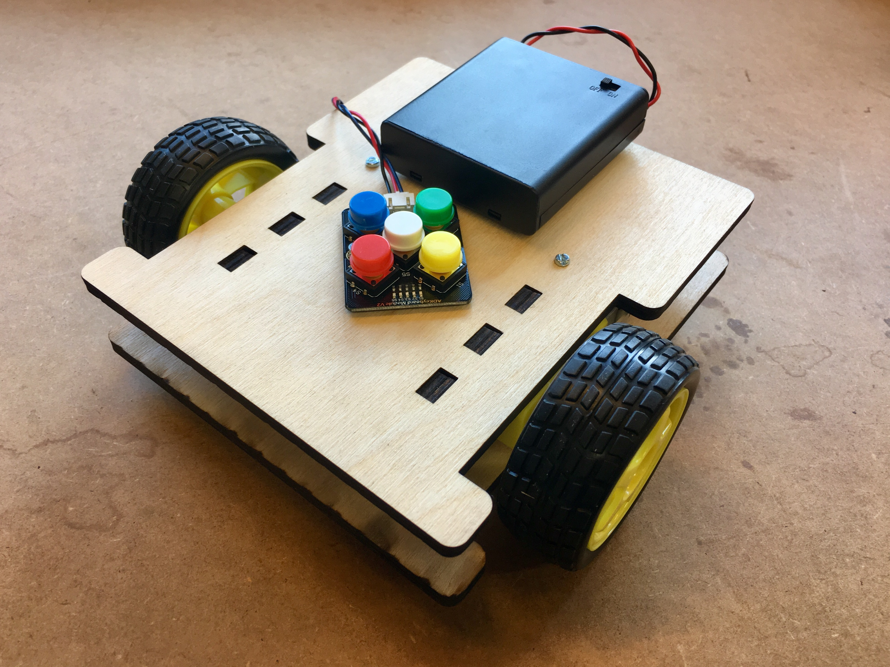
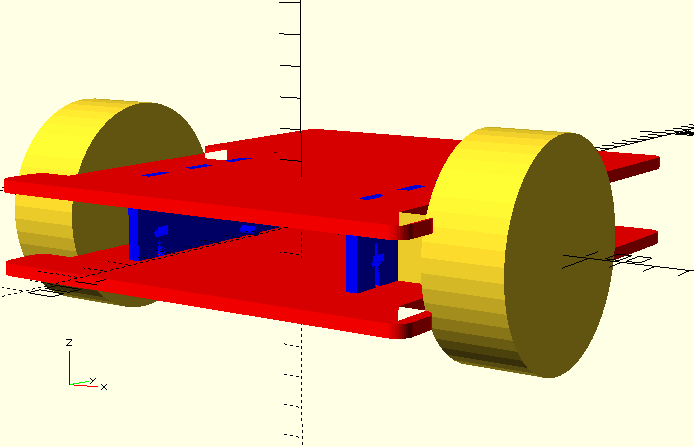

# A-Bot
Een eigen kleine programmeerbare, zelf-rijdende robot maken.  
[http://knutselbaar.be/projecten/A-Bot](http://knutselbaar.be/projecten/A-Bot)

A-Bot versie 1

## Inleiding

Tijdens een bezoek aan [Technolopis](http://technopolis.be) ontdekte onze zoon Arjen, 5 jaar, de [Bee Bot](https://www.bee-bot.us). Een zeer eenvoudige, programmeerbare, zelf-rijdende robot.

Via enkele knoppen kan deze robot geprogrammeerd worden om rond te rijden: rechtdoor, rechts/links draaien,... Op die manier kunnen kinderen eenvoudig leren om via elementaire ruimtelijke instructies de robot een parcours af te laten leggen.

Je kan deze bots kopen, voor ongeveer 80 euro, maar... je kan dit ook vrij eenvoudig zelf maken. Er bestaan zelfs veel kits van gelijkaardige robots, maar... je kan dit ook vrij eenvoudig zelf maken :-)

Dit project is bedoeld om te tonen hoe je dit kan doen en hoe je dus naast veel plezier met de robot zelf, ook heel veel plezier kan hebben om te leren hoe je dit zelf kan bouwen.

Er zijn verschillende aspecten aan: enerzijds de constructie van de robot en anderzijds de programmatie om hem echt tot leven te brengen.

### In deze _repository_

...verzamelen we alle bestanden, documenten, tekeningen, ontwerpen die we maken om de E-Liner te ontwerpen, alsook de software die we er op zetten om hem te laten rijden en te programmeren.

## Versie 1

### Onderdelen

Voor de eerste versie van de A-Bot vertrekken we van een [Particle Photon](https://www.particle.io/products/hardware/photon-wifi-dev-kit). Dit is een Arduino-achtige microcontroller met WiFi en een fantastisch online platform om er mee te werken.

Als aandrijving vertrekken we van een paar eenvoudige DC motoren. Om deze makkelijk aan te sturen, gebruiken we bijkomende chip: de L293. Om de motoren iets beter te kunnen controleren, voegen we ook een _encoder_ toe. 

Een balwiel, enkele knoppen en een batterijbox, maken onze onderdelen lijst compleet.

* 1 x [Particle Photon](https://www.antratek.be/photon) (~&euro;24)
* 1 x set [DC motoren en wielen](https://iprototype.nl/products/robotics/servo-motors/motors-wheels) (~&euro;18)
* 1 x [L293DNE](https://iprototype.nl/products/components/ics/motorcontroller-chip-L293D) (~&euro;5,15)
* 1 x set [Encoders voor DC motor](https://iprototype.nl/products/robotics/misc/dc-motor-encoder) (~&euro;15,50)
* 1 x [Gravity Keypad](https://iprototype.nl/products/components/buttons-switches/gravity-keypad) (~&euro;8)
* 1 x [Ball caster](https://iprototype.nl/products/robotics/misc/ball-caster-30mm) (~&euro;2,30)
* 1 x [Batterijbox 4xAA](https://iprototype.nl/products/accessoires/power/battery-box-4xAA) (~&euro;4,75)

### Chassis Design

Om al deze onderdelen samen te brengen tot een robotje, snijden we uit hout (of plexi) enkele delen met behulp van een laser cutter:

### Electronica & Software

In verschillende stappen kan je zelf je A-Bot opbouwen:

1. [Blink](src/blink/) - Dit is de eenvoudigste test om te controleren dat alles werkt. Het laat de ingebouwde blauwe LED van de Photon blinken.
2. [Motor](src/motor/) - Dit is de basis opstelling voor het aansturen van een motor.
3. [Encoder](src/encoder/) - Dit is de basis opstelling voor het uitlezen van een encoder.
4. [Keypad](src/keypad/) - Dit is de basis opstelling voor het uitlezen van het keypad. 
5. [A-Bot](src/a-bot/) - Deze applicatie brengt alle onderdelen van de A-Bot samen tot een programmeerbaar robotje.
