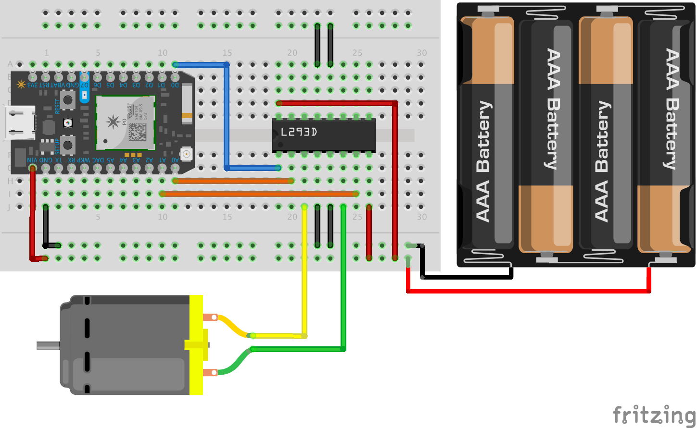

# Motor

Dit is de basis opstelling voor het aansturen van een motor.

## Wat moet je bouwen?



De batterijen voorzien de opstelling van iets meer dan 5V. Hiermee wordt (via de rode draden) enerzijds de Photon van stroom voorzien, als ook de L293D.

De L293D wordt aangestuurd met drie draden per motor: 2 draden dienen om de draai-richting aan te geven (oranje) en 1 draad om de snelheid te bepalen (blauw).


De twee draden waarmee we de draai-richting kunnen aangeven, kunnen samen 4 verschillende situaties aangeven: stilstaan, linksom draaien, rechtsom draaien en remmen.

## Software

In de software zie je één functie die alle logica bevat om een motor aan te sturen:

```c
void motor_update(int16_t snelheid) {
  // houd snelheid binnen grenzen
  if(abs(snelheid) < MIN_SNELHEID) { snelheid = 0; }
  if(abs(snelheid) > MAX_SNELHEID) {
    snelheid = MAX_SNELHEID * (snelheid/abs(snelheid));
  }

  // bepaal draairichting
  if(snelheid == 0) {
    // stop
    digitalWrite(MOTOR1_1A, LOW);
    digitalWrite(MOTOR1_2A, LOW);
  } else if(snelheid < 0) {
    // achterwaarts
    digitalWrite(MOTOR1_1A, HIGH);
    digitalWrite(MOTOR1_2A, LOW);
  } else {
    // voorwaarts
    digitalWrite(MOTOR1_1A, LOW);
    digitalWrite(MOTOR1_2A, HIGH);
  }
  // PWM
  analogWrite(MOTOR1_EN, abs(snelheid));
}
```

## Hoe doe je dit werken op de Photon?

Vanuit de `src/` folder, geef je het commando `make`:

```bash
$ PROJECT=motor make
*** Compileren en flashen van motor
particle flash 370026000447333436363331 motor
Including:
    /Users/xtof/Workspace/knutselbaar/a-bot/src/motor/motor.ino
attempting to flash firmware to your device 370026000447333436363331
Flash device OK:  Update started
*** Start van console uitvoer. Beëindig met 'Ctrl+a k y'.
    Druk op een toets om verder te gaan...
```

De uitvoer van de software toont de veranderingen van de snelheid van de motor:

```
60
80
100
120
140
160
180
200
220
240
260
280
-60
-80
-100
-120
-140
-160
-180
-200
-220
-240
-260
-280
```

